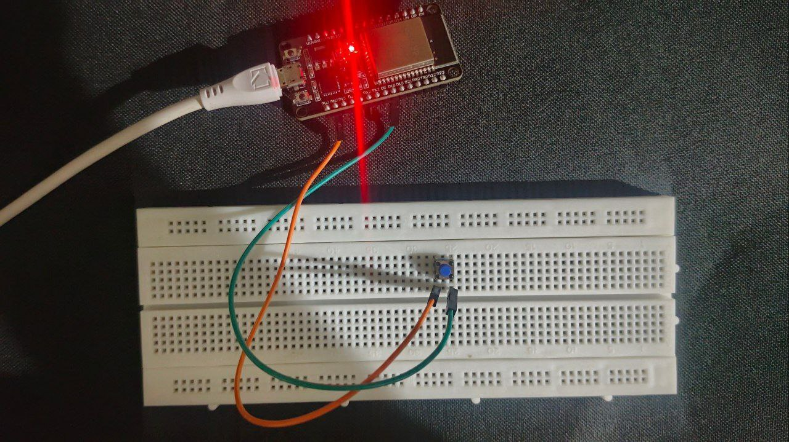
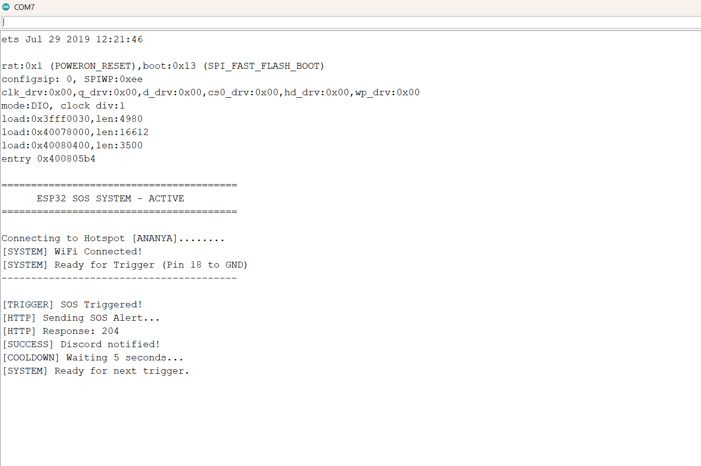
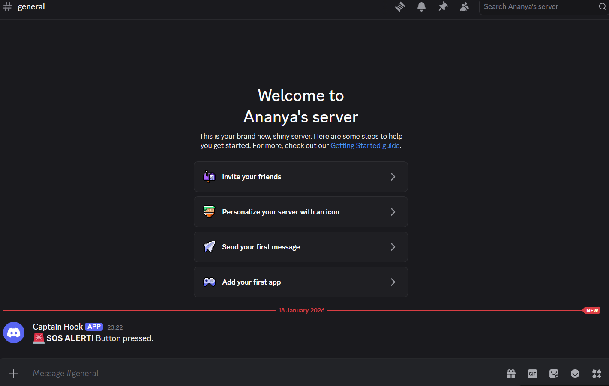

# 🚨 ESP32 Personal SOS System

A simple, reliable emergency alert device that sends a notification to **Discord** the moment a trigger is activated.  
Perfect for a quick-access **panic button** or a **manual emergency alert system**.

---

## 🌟 How It Works

1. The **ESP32 connects to your mobile hotspot**
2. When you **touch the two trigger wires together** (manual switch),
3. The ESP32 instantly sends a **secure alert to a Discord Webhook**
4. Your **Discord channel receives an SOS notification immediately**

---

## 🔌 The Circuit

This project is designed for **maximum simplicity**.  
It uses the ESP32’s **internal pull-up resistor**, so **no external resistors** are required.

### 📍 Pin Layout

| Function       | ESP32 Pin |
|---------------|-----------|
| Trigger Wire  | GPIO 18   |
| Ground Wire   | GND       |

### ⚡ Action
Touch the **GPIO 18 wire** and the **GND wire** together to trigger the SOS alert.

---

## 📸 Screenshots

---
